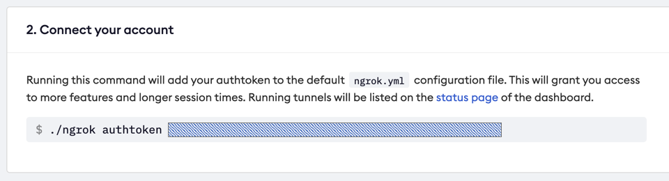

# colab on VSCode

본 문서는 아래 링크의 영상을 참고하여 작성되었습니다.  
[Colab의 고성능 GPU를 로컬 PC에서 사용하는 방법!](https://www.youtube.com/watch?v=oAKxxLy-G5g)

## 1. 계정 생성 및 프로그램 설치하기

1. Google Colab 계성 생성하기
: [Google Colaboratory](https://colab.research.google.com/)
 사이트에 접속하여 Google Colaboratory 계정을 생성합니다.


2. Visual Studio Code 설치하기
: [Visual Studio Code - Code Editing. Redefined](https://code.visualstudio.com/) 사이트에 접속하여 VSCode 를 설치합니다.


3. ngrok 계정 생성하기
: [ngrok - secure introspectable tunnels to localhost](https://ngrok.com/) 사이트에 접속하여 ngrok 계정을 생성합니다.


## 2. 연결하기

1. [https://dashboard.ngrok.com/get-started/setup](https://dashboard.ngrok.com/get-started/setup) 에 접속하고, ngrok 에 로그인 합니다.
아래와 같은 화면에서 본인의 authtoken 내용을 복사합니다.
    

2. google colab 에서 아래 코드를 실행합니다. NGROK_TOKEN 변수에는 본인의 ngrok authtoken 을, PASSWORD 변수에는 접속할 때 사용할 비밀번호를 설정합니다.  
(코드를 실행하기 전에 수정 > 노트 설정에 들어가 하드웨어 가속기를 GPU 로 지정합니다.   
  → 이 부분은 설정하지 않아도 되지만, 제대로 연결되었는지 확인하기 위해 GPU 로 설정하는 것을 권장드립니다.)
    

    ```python
    NGROK_TOKEN = '토큰' # ngrok 토큰
    PASSWORD = '접속할 비밀번호' # 비밀번호 설정

    !pip install colab-ssh

    from colab_ssh import launch_ssh
    launch_ssh(NGROK_TOKEN, PASSWORD)
    ```

    ⇒ 실행 결과 : (HostName, User, Port 는 사용자마다 다를 수 있습니다.)

    
3. VSCode 에서 Extentions → Remote - SSH 를 설치합니다.

    

4. VSCode 에서 (Windows 는 ctrl + shift + p / Mac 은 command + shift + p 를 입력하여)  
  Remote - SSH → Add New SSH Host 에서 ssh User@HostName -p PORT 형식으로 ssh 호스트를 추가합니다.   
  (ex. ssh root@[0.tcp.ngrok.io](http://0.tcp.ngrok.io) -p 15762)

    

5. ssh config 에 정보를 추가합니다.

## 3) 동작 확인

1. SSH TARGETS 에서 연결하고자 하는 HOST 에 오른쪽 마우스 클릭, 원하는 연결 방식을 선택합니다.

    

2. google colab 에서 설정한 비밀번호를 입력합니다.

    

3. Open Folder 를 클릭하고, 원하는 폴더를 선택합니다. (/root/)

    

4. (google colab 에서 하드웨어가속기를 GPU 로 설정한 경우)
터미널을 열어서 google colab 에서 지원하는 GPU를 사용할 수 있는지 확인합니다.
Terminal → New Terminal 에서 nvidia-smi 를 입력하면 아래와 같은 화면이 출력될 것입니다.

    

5. py 파일이 google colab 환경에서 실행되는지 확인하겠습니다.
아래 코드를 실행하면 goolge colab 환경과 동일하게 tensorflow 2.4.0 버전과 GPU 를 사용할 수 있음을 확인할 수 있습니다.

    ```python
    import os
    os.environ['TF_CPP_MIN_LOG_LEVEL'] = '3'
    # Tensorflow 디버깅 정보를 비활성화함. 안해도 무방함

    import tensorflow as tf

    print(tf.__version__)
    print(tf.config.list_physical_devices('GPU'))
    ```

    
